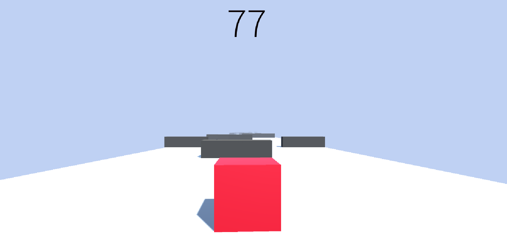
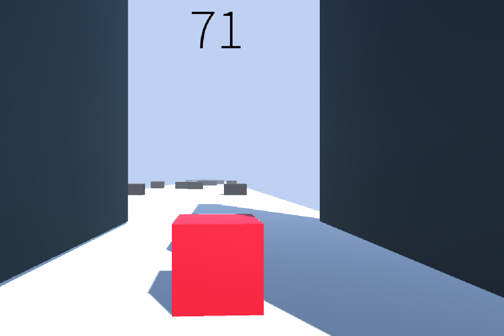

# Block-Adaventure
A small game that I made following along **Brackys tutorial** on youtube. You can learn from this awesome playlist from [here](https://www.youtube.com/watch?v=j48LtUkZRjU&list=PLPV2KyIb3jR5QFsefuO2RlAgWEz6EvVi6).

## Gameplay
The objective of the game is rather simple, you move left and right with **W** and **D** keys and jump with **SPACE** button. Your goal is to avoid the obstacles by movement and jumping. And as time passes, you get scores based on how mauch time you survived the rush!!

For flair, animation and transitions were added to the project. There are currently only two levels that I experimented with. 

Here is what the game looks like in action:

Enjoy!!
